# AI Study

AI Study is an intelligent Android application designed to enhance your learning experience. It leverages the power of Artificial Intelligence to generate personalized study plans, create flashcards from your documents, and provide a smart chatbot assistant to answer your questions.

## Features

*   **🤖 AI Chatbot:** A built-in conversational assistant to help you with your studies, powered by Dify AI.
*   **📅 AI Study Planner:** Generates customized study schedules based on your goals and availability.
*   **🗂️ AI Flashcard Generator:** Automatically creates flashcards from uploaded documents or specific topics to help you memorize key concepts.
*   **📊 Progress Tracking:** Visualizes your study streaks and progress to keep you motivated.
*   **🔐 Secure Authentication:** User login and signup functionality powered by Firebase Auth.
*   **🎨 Modern UI:** Built with Jetpack Compose and Material 3 for a sleek and responsive user experience.

## Tech Stack

### Android App
*   **Language:** Kotlin
*   **UI Framework:** [Jetpack Compose](https://developer.android.com/jetpack/compose) (Material 3)
*   **Architecture:** MVVM (Model-View-ViewModel)
*   **Navigation:** Jetpack Navigation Compose
*   **Networking:** Retrofit, OkHttp
*   **Asynchronous Programming:** Coroutines, Flow
*   **Backend Services:** Firebase (Authentication, Firestore, Analytics)

### Backend API
*   **Framework:** [FastAPI](https://fastapi.tiangolo.com/) (Python)
*   **AI Engine:** [Dify](https://dify.ai/) (for LLM workflows)

## Setup Instructions

### Prerequisites
*   Android Studio Koala or newer.
*   Python 3.9+ installed.
*   A Firebase project.
*   A Dify account and API keys.

### 1. Android App Setup
1.  Clone this repository.
2.  Open the project in Android Studio.
3.  Create a Firebase project and add an Android app with package name `com.example.aistudy`.
4.  Download the `google-services.json` file from Firebase Console and place it in the `app/` directory.
5.  Sync Gradle files.

### 2. Backend Setup
The app requires a local backend to communicate with Dify AI services.

1.  Navigate to the `app/src/main/java/com/example/aistudy/api` directory (or where you moved `app.py`).
2.  Install dependencies:
    ```bash
    pip install fastapi uvicorn python-dotenv requests pydantic
    ```
3.  Create a `.env` file in the same directory with your Dify credentials:
    ```env
    DIFY_API_CHAT=your_chat_api_key
    DIFY_URL=https://api.dify.ai/v1
    DIFY_API_WORK=your_workflow_api_key
    ```
4.  Start the server:
    ```bash
    uvicorn app:app --reload --host 0.0.0.0 --port 8000
    ```

### 3. Running the App
1.  Ensure your Android device/emulator is on the same network as your backend server.
2.  Update the `BASE_URL` in `ApiClient.kt` (or equivalent configuration) to point to your local server IP (e.g., `http://192.168.1.x:8000/`).
3.  Build and run the app from Android Studio.

## Project Structure

*   `ui/`: Contains all Jetpack Compose screens and UI components.
*   `viewmodel/`: Holds ViewModels for managing UI state and business logic.
*   `data/`: Data classes and models.
*   `api/`: Retrofit service definitions and the Python FastAPI backend script.
*   `navigation/`: Navigation graph and route definitions.
*   
## Demo

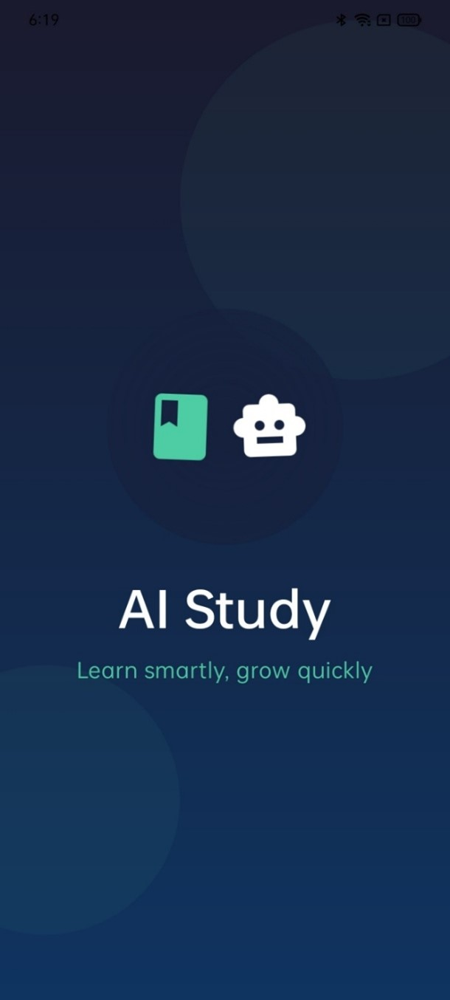<br>
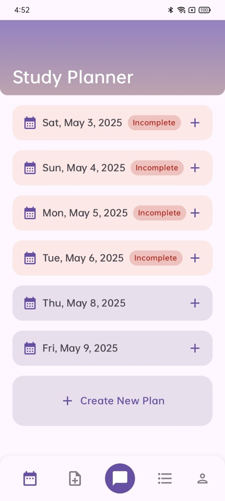<br>
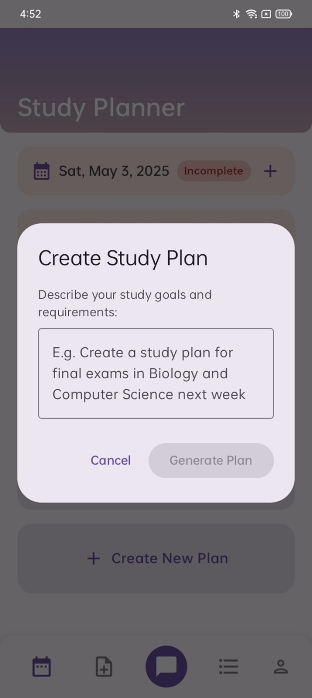<br>
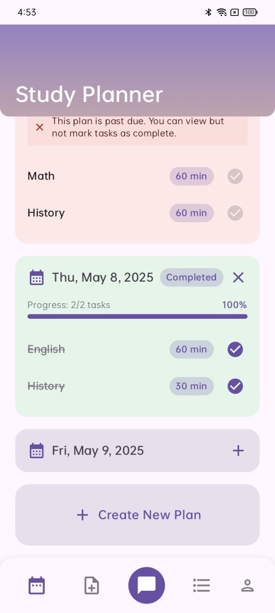<br>
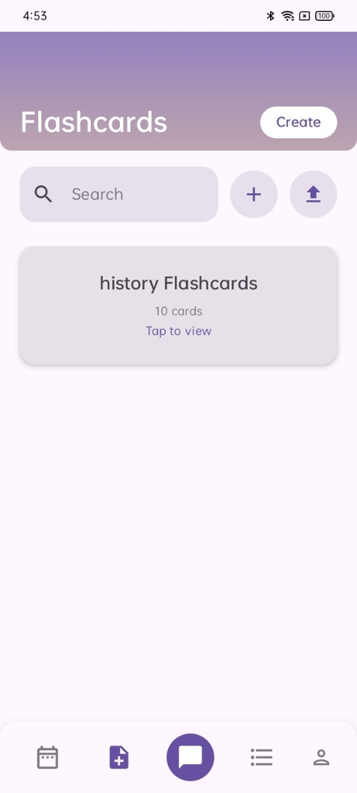<br>
<br>
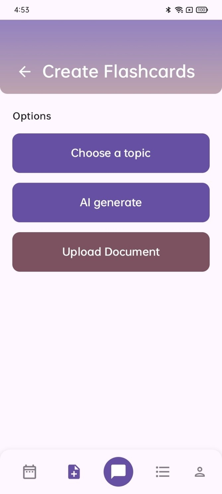<br>
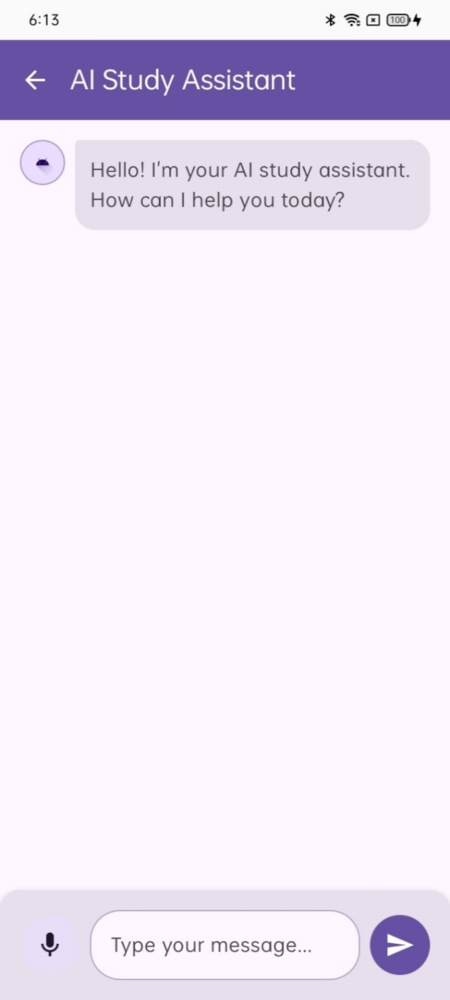<br>
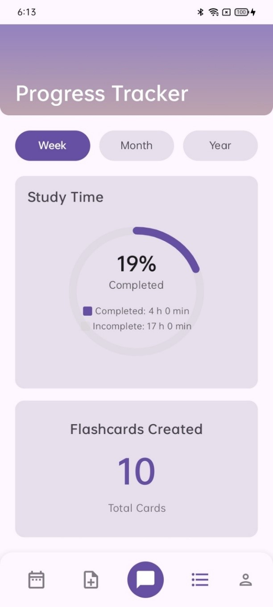<br>
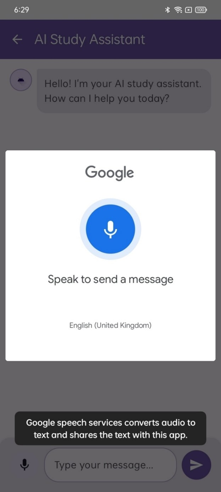<br>
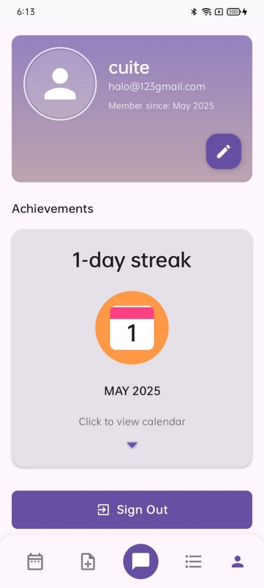<br>
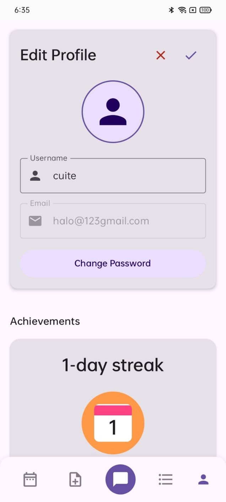<br>
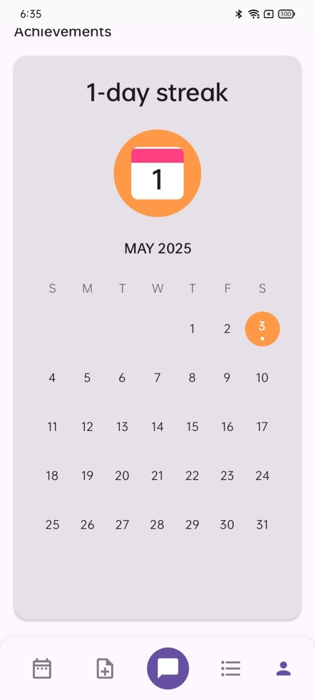<br>
